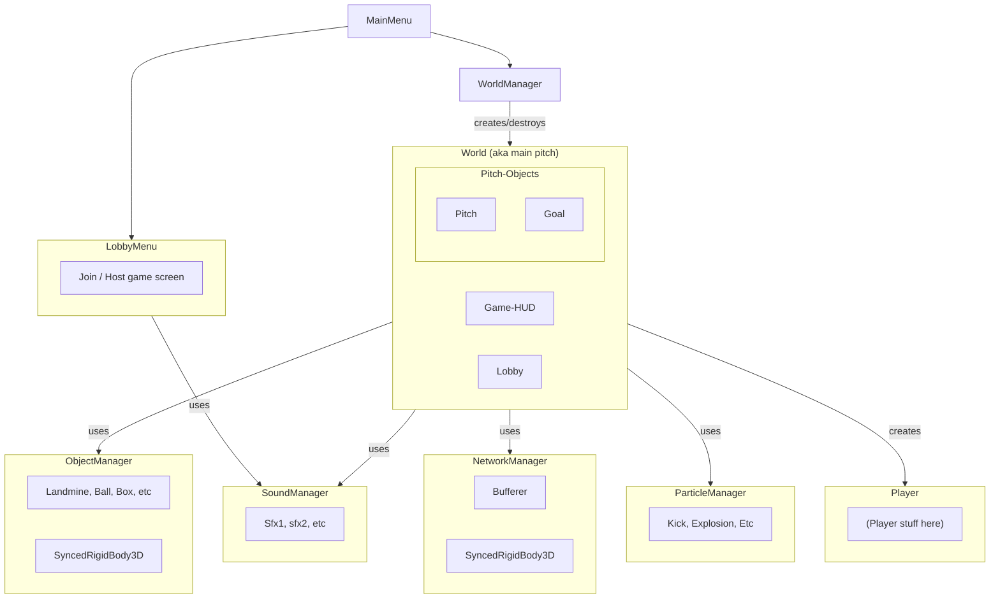

```mermaid
graph TD
    MainMenu

    MainMenu --> LobbyMenu

    subgraph LobbyMenu
        HostMenuu[Join / Host game screen]
    end

    MainMenu --> WorldManager
    WorldManager -- creates/destroys --> World

    LobbyMenu -- uses --> SoundManager

    World -- uses --> ObjectManager
    World -- uses --> SoundManager
    World -- uses --> NetworkManager
    World -- uses --> ParticleManager
    World -- creates --> Player

    subgraph World["World (aka main pitch)"]
        Game-HUD
        subgraph Pitch-Objects
            Pitch
            Goal
        end
        Lobby
    end

    subgraph Player
        PlayerStuff["(Player stuff here)"]
    end
    
    subgraph NetworkManager
        D[Bufferer]
        F[SyncedRigidBody3D]
    end

    subgraph ParticleManager
        Particles[Kick, Explosion, Etc]
    end

    subgraph SoundManager
        SoundEffects[Sfx1, sfx2, etc]
    end

    
    subgraph ObjectManager
        G[Landmine, Ball, Box, etc]
        H[SyncedRigidBody3D]
    end
```

