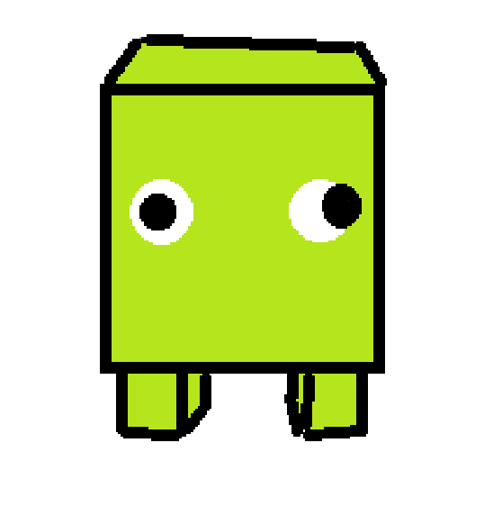

## GAME DESIGN: Core tenets-
- Party game
- Fun with friends

Can we somehow structure the game such that it's naturally party-like?

 
 
 
 

## PARTY-IDEA:
FFA-style football!

Every player gets a score.
Every round, teams are shuffled, 3v3 football.

When a team scores, all players on that team gets a point.
Then, the teams are shuffled again.

If there's an odd number of players, (eg. 7), 
one player becomes the "ref", 
and the refs objective is to ensure nobody scores.

 
 
 
 

## DIFFERENTIATION IDEA:
We also should look at differentiating it a bit from football.
--->  
- What if the goals were elevated off the ground...?
- Ramps where the goals are?

 
 
 
 
 

## Player character:

- Easy to model,
- Quite unique/distinctive
- Basically, a cube shape with short little legs.
- Note the eyes! They need to look funny
- Probably should have slightly rounded corners? so it looks a bit better

- (Stump legs could maybe "blend" with the body?)
- ^^^ This is probably too hard!!! Maybe just make legs same color as body.

